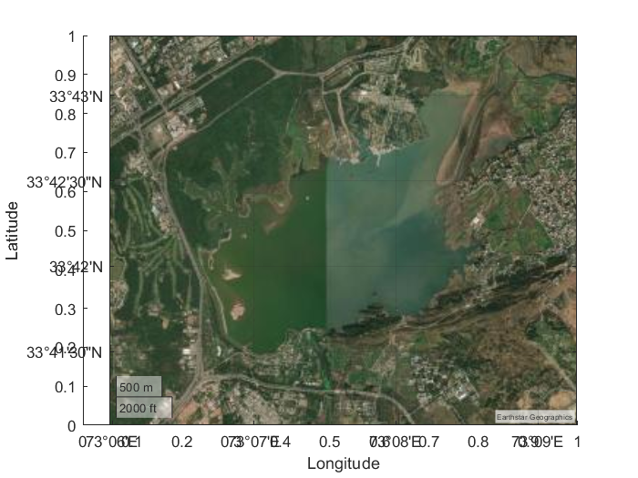
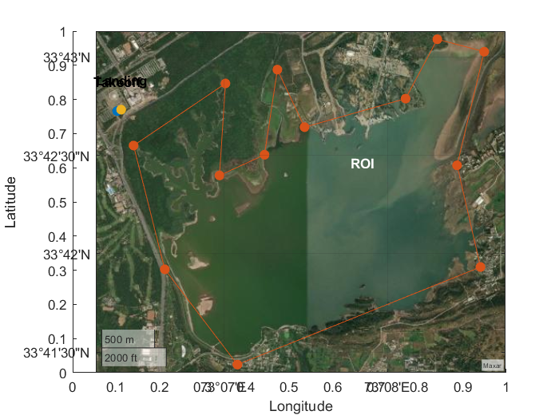
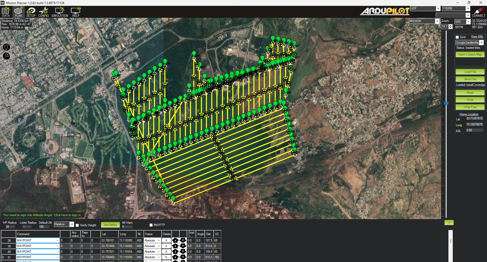

# UAV-Coverage-Planning

This repository provides a MATLAB implementation to create a **custom coverage path** for surveying a region of interest (ROI), with an example application for **Rawal Lake** in Rawalpindi. The project is inspired by the MATLAB example: [Optimally Survey and Customize Coverage of Region of Interest](https://www.mathworks.com/help/uav/ug/optimally-survey-and-customize-coverage-of-region-of-interest-using-coverage-planner.html).

## Features
- **Map Importing**: Load geospatial data for any location as the base map.
- **Customizable ROI**: Define the ROI interactively by drawing boundaries and specifying takeoff/landing positions.
- **Region Decomposition**: Divide the ROI into simpler regions for efficient path planning.
- **Path Planning and Optimization**: Automatically generate and optimize a coverage path for complete survey of the ROI.
- **Export Waypoints**: Save the optimized waypoints in `.waypoints` format, ready for import into Mission Planner.

## Workflow
1. **Import Map**: Load a map of the region (e.g., Rawal Lake).
2. **Define ROI**: Use interactive tools to draw the ROI boundaries and mark takeoff/landing points.
3. **Divide ROI**: Decompose the region into smaller, manageable areas for efficient path planning.
4. **Plan Path**: Generate a coverage path that surveys the entire region.
5. **Optimize Path**: Refine the generated path to minimize travel time and energy.
6. **Export Waypoints**: Save the final optimized path as a `.waypoints` file, which can be directly used in Mission Planner or other ground control software.

## Example Application: Rawal Lake Survey
This example demonstrates a complete workflow for planning a survey of **Rawal Lake**:
- A satellite map of Rawal Lake is imported as the base map.
  
- The ROI is defined interactively.
  
- The planner decomposes the ROI into smaller sub-regions and generates an efficient coverage path.
  
- The optimized waypoints are exported and ready to be used for autonomous UAV missions.
- 

## Customization
This code is **fully customizable**:
- Clone the repository and modify the input map to survey any region of interest.
- Adjust ROI boundaries, takeoff/landing positions, and other parameters as needed.
- Generate waypoints for various applications like agricultural monitoring, environmental surveys, or urban planning.
